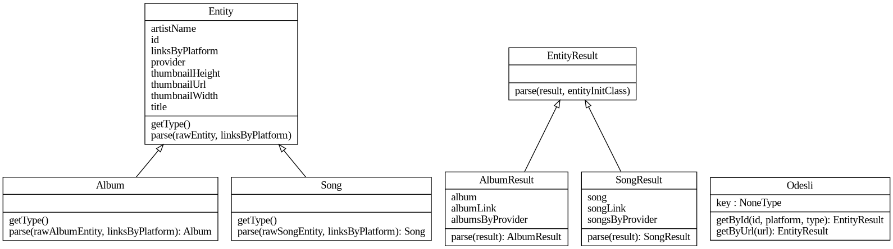

# python-odesli

Odesli/Songlink API wrapper for python.

## Installation

```bash
pip install odesli
```

### From source

Install the pypi package `build` using pip:
```bash
pip install build
```

Then (from the root of the repo):
```bash
python -m build
pip install dist/*.whl
```

## Usage

Convert spotify to tidal and youtube music link:
```python
from odesli.Odesli import Odesli

odesli = Odesli()
result = odesli.getByUrl('https://open.spotify.com/track/1jJci4qxiYcOHhQR247rEU')

print(result.songsByProvider['tidal'].linksByPlatform['tidal'])
print(result.songsByProvider['youtube'].linksByPlatform['youtubeMusic'])
```



## Projects using this wrapper

- [odesli-cli](https://github.com/fabian-thomas/odesli-cli)
